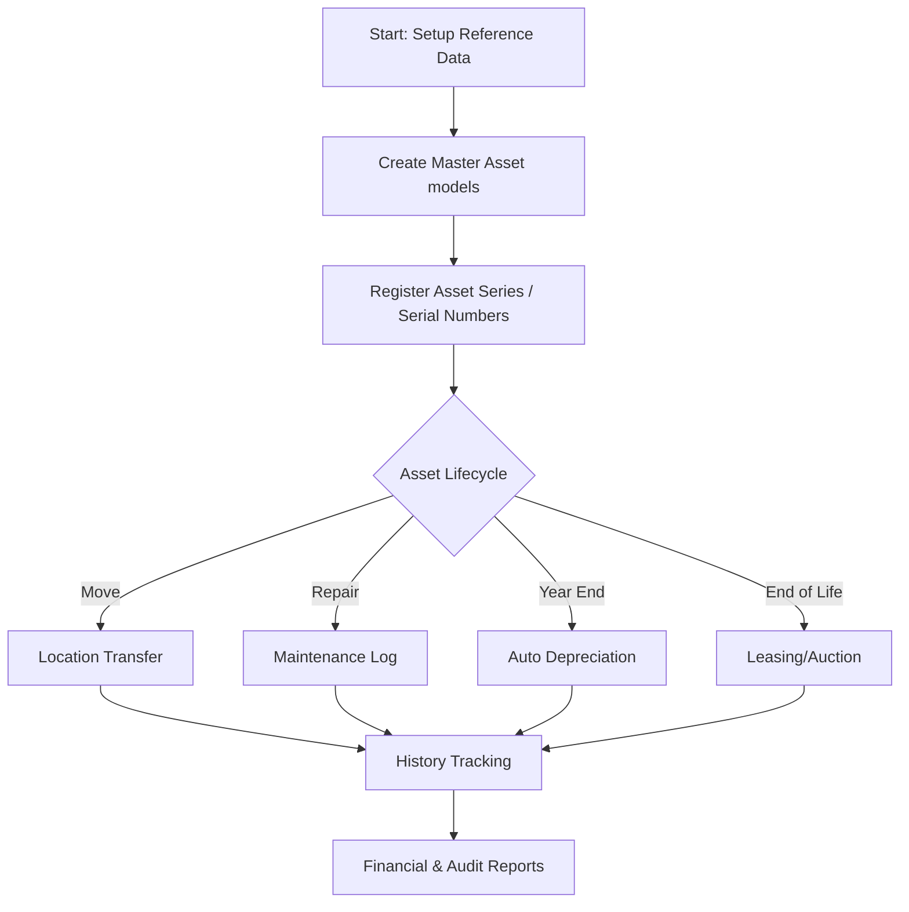

# Simple Small Business Asset (Sbiz-Asset)

A lightweight asset management system designed for small and medium-sized businesses to manage inventory, track asset lifecycles, and handle financial depreciation.

## 1. Business Purpose and Benefits

**Sbiz-Asset** helps businesses stay organized by providing a central place to record all fixed assets (furniture, electronics, machinery, etc.). 

*   **Financial Clarity**: Track asset values, acquisition costs, and current net values after depreciation.
*   **Asset Auditing**: Easily track where each asset is located and which department is responsible for it.
*   **Operational Efficiency**: Manage repairs and maintenance history to prevent equipment failure.
*   **Strategic Planning**: Detailed reports help in planning future equipment purchases and budgeting.

---

## 2. Application Flow

Below is the general workflow of the system from setup to reporting:



1.  **System Config**: Initialize locations, funds, and categories.
2.  **Asset Entry**: Register models and then individual units (Serial Numbers).
3.  **Transactions**: Track and update asset status periodically.
4.  **Reporting**: Export audit and financial data.

---

## 3. Installation with Docker

Follow these steps to run the application instantly using Docker.

### Prerequisites
*   Docker & Docker Compose installed.

### Included Files
The project already contains the necessary Docker files:
*   `Dockerfile`: Configures PHP 8.1 with Apache and `mysqli` extension.
*   `docker-compose.yml`: Sets up the application and MariaDB 10.1.19 database.

### Running the Application
1.  Open your terminal in the project root.
2.  Run:
    ```bash
    docker-compose up -d
    ```
3.  Access the app at: `http://localhost:8080`

### Database Setup
The database is automatically pre-configured using `data-sample/struucture-with-data-sample.sql`. 

**Current Database Config in `apps/config/config.php`**:
```php
$config['db']['server'] = 'db'; 
$config['db']['username'] = 'root';
$config['db']['password'] = 'root';
$config['db']['database'] = 'sbiz_asset';
```

---

## 4. User Management

The application uses role-based member management to control access.

*   **Member List**: Shows all registered staff, their positions, and active status.
    
*   **Adding Users**: Create new staff accounts and set permissions.
    

---

## 5. User Manual

### Part 1: Dashboard and Search
The **Home Dashboard** provides a statistical summary of asset conditions and total investment value.


The **Asset Info Center** allows quick searching of any asset by its serial number to see its current status, price, and location.


### Part 2: Setting up Reference Data (Master Data)
Before adding assets, you must configure your organization's hierarchy:
*   **Funding Sources**: Record where assets were funded (e.g., Internal, Loans).
    
*   **Locations & Sub-Locations**: Manage buildings, rooms, and specific desks.
    
    
*   **Departments**: List internal teams.
    
*   **Categories**: Group items like Electronics, Furniture, or Vehicles.
    

### Part 3: Asset Registration
1.  **Main Asset Registry**: List various item models and sizes.
    
2.  **Asset Series (Units)**: Register each physical item with its unique Serial Number, Brand (Merk), and Purchase Date.
    
    

### Part 4: Managing Transactions
*   **Asset Movement**: Use the **Move** feature to officially transfer an item between locations.
    
    
*   **Repairs & Fixing**: Log maintenance activities and see when an item was last repaired.
    
    
*   **Depreciation**: Automatically calculate the current book value for all assets at year-end.
    
    
    
*   **Auction & Disposal**: Manage the sale (lelang) of old assets.
    
*   **History Logs**: Every action (Move, Fix, Depreciate) is logged for full audit traceability.
    
    

### Part 5: Comprehensive Reporting and Auditing
Generate professional reports for management or tax purposes:

#### Financial & Values
*   **Asset Value Report**: Shows acquisition cost vs current (net) value.
    
    
    

#### Location & Audit
*   **Location-based Audit**: Know exactly what is in which room.
    
    
    
    

#### Funding & Condition
*   **Funding Report**: Summary of assets based on source of funds.
    
    
    
*   **Physical Condition Report**: Summary of item health (Good vs Broken).
    
    
    
    

#### Movement & Sequence history
*   **Asset History Report**: Full trail of an asset's journey.
    
    
    
*   **Last Serial Number**: Track the sequence of generated IDs.
    
